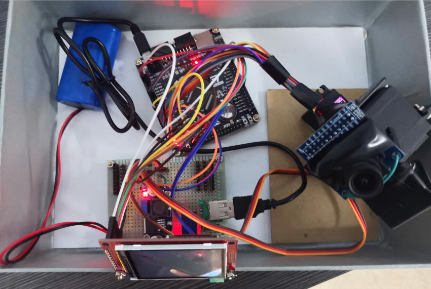
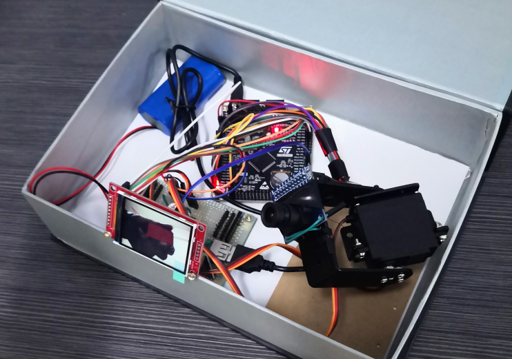
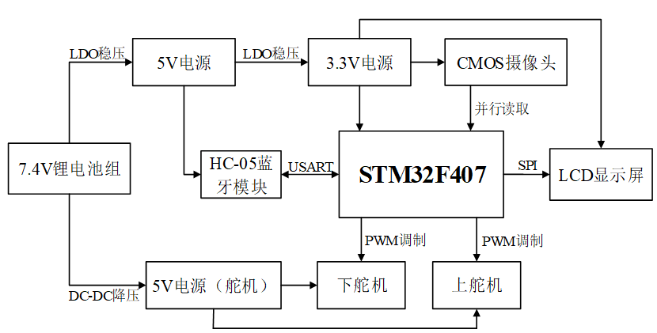
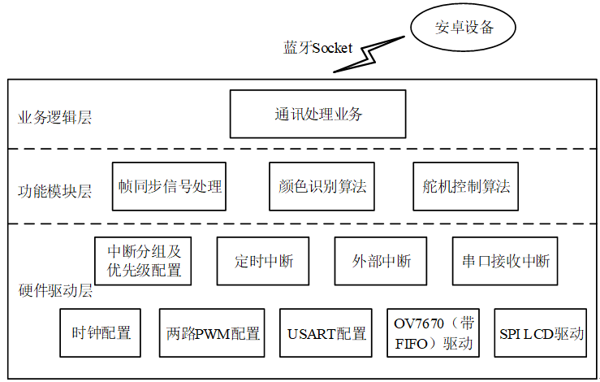
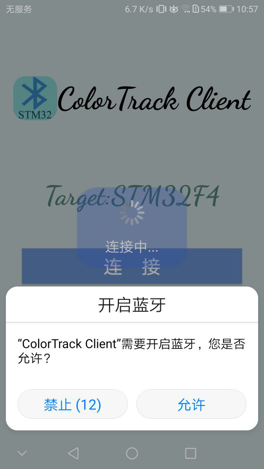
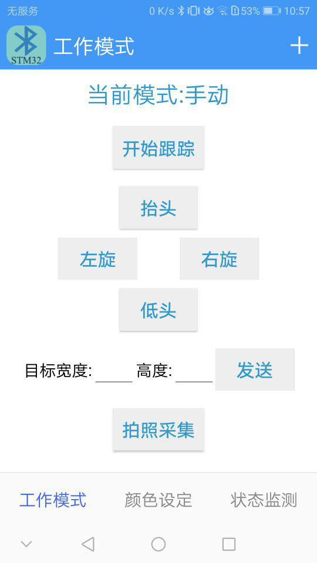
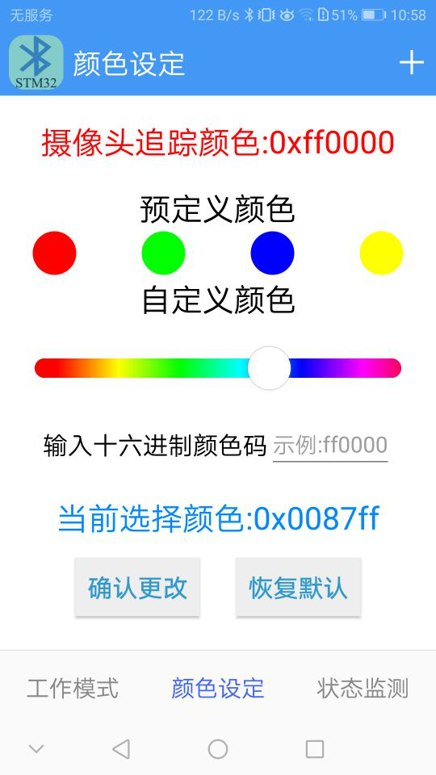
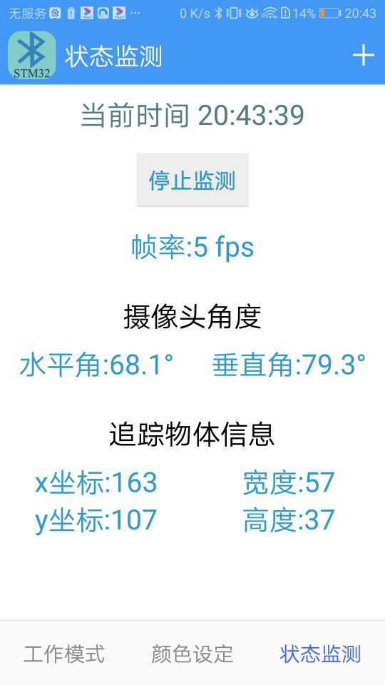

# color_track
#### Color recognition and tracking based on STM32F407, android app use bluetooth to connect MCU.  
#### 基于STM32F407的颜色识别与目标跟踪，安卓APP通过蓝牙连接单片机

### 简述
    对摄像头采集的图像进行颜色识别，通过二自由度舵机云台实现颜色跟踪以保持目标物体位于视野中央，利用手机APP发出控制指令实现交互。

### 具体内容
1. 微控制器采用STM32F407VET6单片机，采集CMOS摄像头（OV7670带FIFO）的图像数据并实时送至SPI LCD显示。
2. 用两个180度舵机搭建一个旋转云台，分别控制摄像头的水平和垂直两个自由度的旋转，利用PD控制算法调整舵机的角度。
3. 将采集到的RGB565像素数据转换成HSL颜色空间，根据HSL阈值条件通过识别算法迭代计算出目标物体的坐标和大小。
4. 预定义颜色通过人为调整阈值改善识别效果，自定义颜色可设定任意RGB，或通过拍照采集方式自动计算判定条件，以适应光源复杂性。
5. 手机APP设定三个Fragment：工作模式、颜色设定、状态监测，连接单片机上的HC05蓝牙模块，发送控制的指令并接收运行的状态信息。

### 硬件清单
- STM32F407VET6最小系统板
- 带FIFO的OV7670摄像头
- TFT SPI液晶屏（分辨率320×240）
- HC-05蓝牙模块
- MG996R舵机两个
- 舵机云台支架
- 7.4V锂电池组
- LM2596S可调DC-DC降压模块（舵机供电）
- AMS1117-5.0 LDO稳压模块
- 万能PCB板等

### 整体预览

	
    

### 识别效果

	
	

### 硬件架构

	

### 软件架构

	

### APP界面

	
	
	
	

